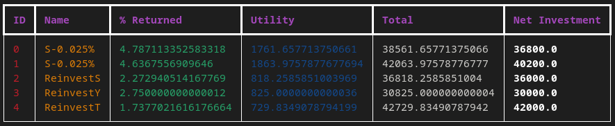
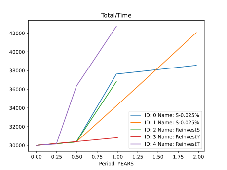

# Interest Analysis Tool (*IAT*)
### *By Fernando Lavarreda*
## Commandline tool designed to analyze different scenarios with varying interests and deposits. 

We have all heard the compound interest formula where $A=P(1+r)^n$ and how it is present in many common instances of our lives like credit cards, loans, savings accounts, etc.
However, have you ever wondered about the behavior in more complex situations? What if you had a fixed deposit and at the end of the term you reinvested the returns
alongside an *s* extra amount that you had saved separately. What if you did this *n* times but each time you added a variable amount of money? Finally, what 
if this variable amount of money was the result of a shorter-term fixed deposit (i.e invest into a yearly fixed the deposit the returns from a thrimonthly fixed deposit
that has in itself been compounded four times)?

This is the purpose of this tool: a thought experiment with graphical and numerical outputs that may result useful.



## Usage

To get a detailed description on how to use tha application run it with the help command.
```bash
python compare_interests.py --help
```

### Quickstart

To run an analysis three arguments are essential: rate, deposits and time.

- rate: percentage being returned. Example 1: 0.02:Y which means two percent annual returns.
  Example 2: 0.02:Y:M which will be translated to $0.02*\frac{30}{365}$ capitalized every month.
  Example 3: 0.02:M:Y which will translate to $(1+0.02)^{365/30}-1$. 
- deposits: deposits at the end of each capitalization. First value is initial balance. Example: 10000:1000:1000;
  initial deposit of 1e4 with two deposits of 1e3.
- time: time interval of the analysis. For exmaple: 6:Y which means six years.

For help on particular commands type:
```bash
python compare_interests.py --help command-name
```
Example of minimal commnad:
```bash
python compare_interests.py --rate 0.02:Y --deposits 10000:1000:1000 --time 1:Y
```
For more examples on the syntax look at *tests/t1* and *tests/t2*

The program can plot the total balance through time



## Installation

1. Clone repository:
```bash
cd IAT
git clone https://github.com/FernandoLavarreda/IAT
```

2. Start Python environment.

   Using venv
   ```bash
   python -m venv venv
   source ./venv/bin/activate
   ```

4. Install dependencies
```bash
python -m pip install -r requirements.txt
```

4. Start program

   To display menu
```bash
python compare_interests.py --help
```

## Tests

Tests are designed for pytest. Simply run pytest in the root directory.
```bash
pytest
```
